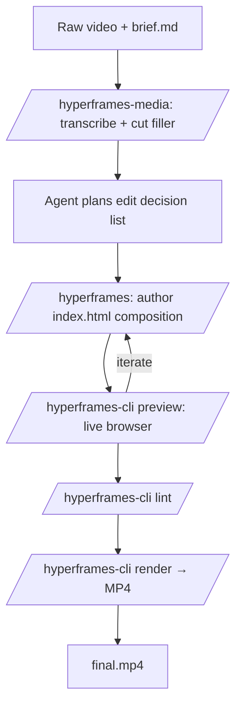

## Source

Inspired by the YouTube walkthrough [*Claude + Hyperframes V2 automates video editing like never before (NEW Skill)*](https://www.youtube.com/watch?v=4E2I_NJkzhI). This document re-expresses the demo as a reusable product blueprint for an AI agent that edits videos end-to-end.

## Product idea

**ClipForge** — an AI video editor agent. The user drops a raw recording into a folder and writes a one-sentence brief ("cut filler words, add a lower third at 0:04 with my name, end with a CTA"). The agent transcribes, plans the edit, authors a Hyperframes composition, previews, and renders the final MP4. Deterministic output: same input + brief always produces the same video.

## Stack

| Layer | Tool |
| --- | --- |
| Orchestrator | Claude Code (Agent SDK) |
| Composition runtime | [Hyperframes V2](https://github.com/heygen-com/hyperframes) (HTML + GSAP + Tailwind v4) |
| Skills | `/hyperframes`, `/hyperframes-cli`, `/hyperframes-media`, `/gsap` |
| Media preprocessing | Whisper (transcription), Kokoro (TTS), background removal |
| Render backend | Headless Chrome → FFmpeg → MP4 |

## Project layout

```
clipforge/
  brief.md                # User's plain-language instructions
  assets/
    raw/                  # Input video, logo, music
    processed/            # Trimmed clips, captions.vtt, tts.wav
  composition/
    index.html            # Hyperframes composition (HTML + data-*)
    timeline.js           # GSAP timeline
    styles.css            # Tailwind v4
  out/
    preview.mp4
    final.mp4
  hyperframes.config.json
  CLAUDE.md               # Agent instructions (this workflow)
```

## End-to-end workflow



### Step 1 — Ingest

- Read `brief.md` and inventory `assets/raw/`.
- Probe duration, resolution, and audio tracks via `ffprobe`.

### Step 2 — Preprocess (`/hyperframes-media`)

- Transcribe audio with Whisper → `captions.vtt`.
- Detect filler words ("um", "uh", long pauses > 700 ms).
- Emit a cut list (`cuts.json`) of timestamp ranges to remove.
- Optional: Kokoro TTS for intro/outro voiceover; background removal on B-roll.

### Step 3 — Plan (Claude reasoning)

Agent produces an **Edit Decision List** as JSON:

```json
{
  "tracks": [
    { "id": "main", "src": "assets/raw/take.mp4", "cuts": "cuts.json" },
    { "id": "lower-third", "start": 4.0, "duration": 3.5, "text": "Mayur Choubey" },
    { "id": "captions", "src": "assets/processed/captions.vtt" },
    { "id": "cta", "start": -5.0, "duration": 5.0, "text": "Subscribe" }
  ],
  "brand": { "primary": "#0F62FE", "font": "Inter" }
}
```

### Step 4 — Author composition (`/hyperframes`)

Agent writes `composition/index.html` with `data-start`, `data-duration`, `data-track-index` on each element, a paused GSAP timeline, and Tailwind v4 utility classes.

```html
<div id="stage">
  <video data-start="0" data-src="assets/raw/take.mp4" data-cuts="cuts.json"></video>
  <div data-start="4" data-duration="3.5" class="lower-third">Mayur Choubey</div>
  <track data-src="assets/processed/captions.vtt" kind="captions"></track>
</div>
```

### Step 5 — Preview & iterate (`/hyperframes-cli`)

```bash
hyperframes preview            # hot-reload browser preview
hyperframes lint               # validates timing + structure
```

The agent watches lint output and refines the composition until clean.

### Step 6 — Render

```bash
hyperframes render --out out/final.mp4
```

Headless Chrome captures frames; FFmpeg encodes. Same inputs → byte-identical output.

### Step 7 — Deliver

Return `out/final.mp4` plus a changelog summarizing cuts made, overlays added, and total runtime saved.

## Agent contract (`CLAUDE.md` excerpt)

```md
You are ClipForge, an AI video editor.

Inputs: assets/raw/, brief.md
Outputs: out/final.mp4, changelog.md

Always:
1. Read brief.md before touching assets.
2. Run /hyperframes-media to transcribe and detect filler before planning.
3. Persist the Edit Decision List to plan.json before writing HTML.
4. Run `hyperframes lint` before every render.
5. Never mutate assets/raw/. Write derived files to assets/processed/.
6. If the brief is ambiguous (e.g. unspecified brand color), ask once, then proceed.
```

## Productization notes

- **Pricing hook**: charge per rendered minute; preview is free.
- **Moat**: deterministic renders enable diff-based re-edits — change one line of the brief, re-render only affected segments.
- **Distribution**: ship as a Claude Code plugin (`/clipforge`) plus a hosted SaaS that wraps the same agent loop.
- **Extensions**: add `/hyperframes` block catalog (lower thirds, CTAs, transitions) as paid template packs.

## Next steps to build

1. `npx skills add heygen-com/hyperframes` in a fresh repo.
2. Drop a sample `brief.md` and one raw clip into `assets/raw/`.
3. Add the agent contract above as `CLAUDE.md`.
4. Run `claude` and ask: *"Edit the clip per brief.md."*
5. Iterate on the prompt until the rendered MP4 matches expectations, then freeze the contract.
